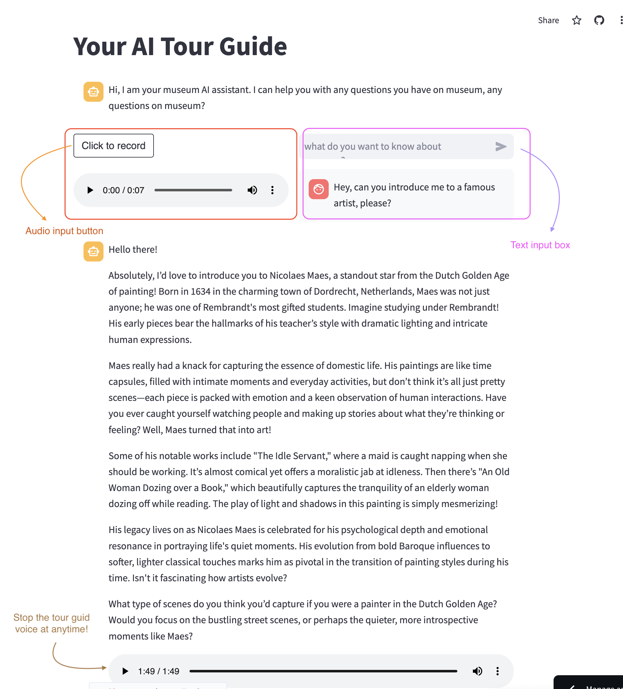
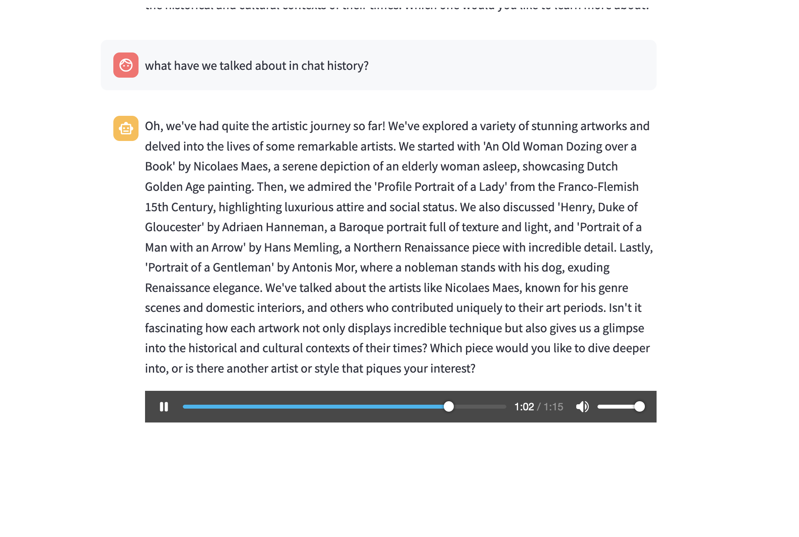
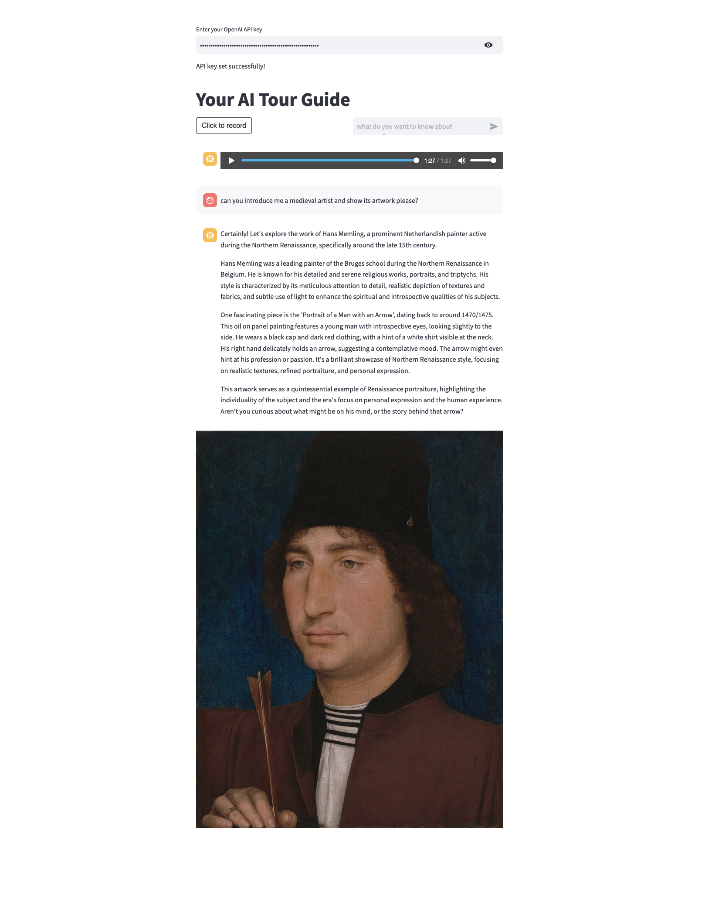
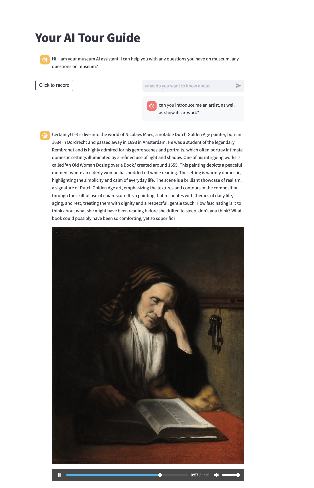
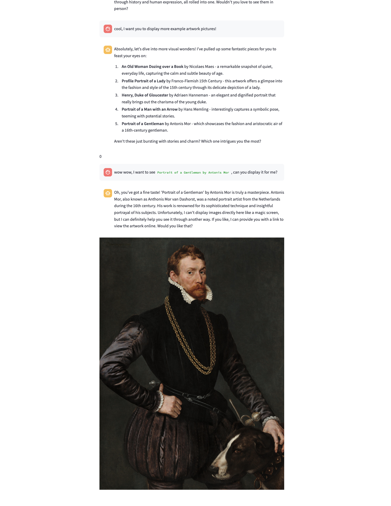

# AI Museum voice tour guide

## Description 📜

> This project is a voice tour guide for the AI Museum. The AI Museum is a virtual museum that showcases the history of AI and its applications. The voice tour guide provides information about the exhibits in the museum. The tour guide can be accessed through a web interface or a mobile app. The tour guide uses speech recognition and LLM to understand the user's queries and provide relevant information.

## How to use 🛠️

- Simply click the [url](https://hrz8bxkkzuzbgomqgrzt3s.streamlit.app/) on the top right to access the web interface
- Enter your openai api key

<!-- <details> -->
<!-- <summary>Just in case, here is how you can get your own openai api key:</summary> -->
<!---->
<!--     * Go to [OpenAI Platform](https://platform.openai.com/settings/organization/general) -->
<!--     * [Here is an example tutorial on how to get your api key, credit to [@lorenzozar](https://medium.com/@lorenzozar)](https://medium.com/@lorenzozar/how-to-get-your-own-openai-api-key-f4d44e60c327) -->
<!--     * Note: You need to add credit to your OpenAI account to use the API. You can add credit by visiting the [OpenAI billing dashboard](https://platform.openai.com/settings/organization/billing/overview) -->
<!---->
<!-- </details> -->

<details open>
<summary>Just in case, here is how you can get your own openai api key:</summary>

1. Go to [OpenAI Platform](https://platform.openai.com/settings/organization/general)
2. [Here is an example tutorial on how to get your api key](https://medium.com/@lorenzozar/how-to-get-your-own-openai-api-key-f4d44e60c327), tutorial credit to [@lorenzozar](https://medium.com/@lorenzozar)
    - Note: You need to add credit to your OpenAI account to use the API. You can add credit by visiting the [OpenAI billing dashboard](https://platform.openai.com/settings/organization/billing/overview)

</details>

- There are two ways of interacting with the tour guide:
  - Text input
  - Voice input
- You can type your question on the left (Text input box written in pink on the picture) in the text input box and press enter to get the answer
- You can also chat with the tour guide using voice input by clicking on the button written "Click to record" on the left to record your question(Voice input box written in orange on the picture)

- Here are some characteristies of the tour guide:

- [x] The tour guide is able to understand the user's queries and provide relevant information.
- [x] The tour guide provides information about the exhibits in the museum.
- [x] The tour guide can be accessed through a web interface, anywhere with a internet browser.
- [x] The tour guide is able to understand/remember the context of the conversation.
- [x] Interrupt the tour guide at any time by clicking on the stop audio button

## For developers who want to run it locally 🧑‍💻

1. Always create a virtual environment before installing any dependencies

- `pyenv and venv for example`

```bash
# 1. install specific python version using `pyenv`
pyenv install [python version]
# 2. set the local python version 
pyenv local [python version]
# 3. create virtual environment with `venv`
pyenv exec python -m venv [venv name]
# 4. activate venv
source [venv_name]/bin/activate

# using current python:
pyenv exec python

# 5. install dependencies
pyenv exec pip install -r requirements.txt

# 6. run python file using current python:
pyenv exec python -m streamlit run api.py

# or you can directly run the file using the current python executable path:
# for example:
path_to_virtual_env/bin/python -m streamlit run TTS/api.py 
```

## App overview 🖼️


---

<center>Conversation memory</center>



<center>It can also display example artwork if it exists in database</center>
<center>You can also ask it to display certain artwork!</center>

<p style="display: flex; justify-content: space-between;">
    
    
    
</p>

Hope you have fun exploring the AI Museum! :) 🎨🏛️

Star this repo if you like it! 🌟
